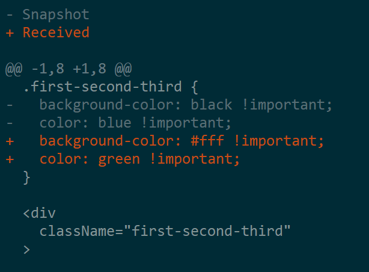

# jest-aphrodite-react

Jest Snapshot serializer for Aphrodite. Based off the serializer from [jest-glamor-react](https://github.com/kentcdodds/jest-glamor-react).

## The problem

If you use [`aphrodite`][aphrodite] as your CSS-in-JS solution, and you use
[snapshot testing][snapshot] with [jest][jest] then you probably have some test
snapshots that look like:

```html
<div
  className="root_10eoyjn"
/>
  Hello World
</div>
```

And that's not super helpful from a styling perspective. Especially when there
are changes to the class, you can see that it changed, but you have to look
through the code to know _what_ caused the class name to change.

## This solution

This allows your snapshots to look more like:

```html
.root {
  color: red !important;
}

.root:hover {
  color: green !important;
}

@media (min-width: 200px) {
  .root:hover {
    color: black !important;
  }
}

<div
  className="root"
/>
  Hello World
</div>
```

This is much more helpful because now you can see the CSS applied and over time
it becomes even more helpful to see how that changes over time.

This builds on the work from [@MicheleBertoli][michelebertoli] in
[`jest-styled-components`][jest-styled-components] and [@kentcdodds][kentcdodds] in [`jest-glamor-react`][jest-glamor-react] to bring a similar experience
to React projects that use [`aphrodite`][aphrodite].

### Preview



## Installation

This module is distributed via [yarn][yarn] or [npm][npm] which is bundled with [node][node] and
should be installed as one of your project's `devDependencies`:

```
yarm add --dev jest-aphrodite-react
```

or

```
npm install --save-dev jest-aphrodite-react
```

## Usage

At the top of your test file:

```javascript
import { serializer } from 'jest-aphrodite-react';

expect.addSnapshotSerializer(serializer);
```

Or in your Jest serializer config:

```javascript
{
  snapshotSerializers: ['jest-aphrodite-react'];
}
```

## Examples

For environment setup set [./jestSetup.js](/jestSetup.js) and for test examples for both [enzyme][enzyme] and [`react-test-renderer`][react-test-renderer] see [./src/serializer.test.tsx](./src/serializer.test.tsx)

## Inspiration

As mentioned earlier, [@MicheleBertoli][michelebertoli]'s
[`jest-styled-components`][jest-styled-components] and [@kentcdodds][kentcdodds]'s [`jest-glamor-react`][jest-glamor-react] were a huge inspiration for
this project. And much of the original code came from from those MIT Licensed
projects. Thank you so much Michele and Kent! 👏

## Other Solutions

I'm unaware of other solutions. Please file a PR if you know of any!

## Code of Conduct

Contributions of any kind welcome!

[COC](./other/CODE_OF_CONDUCT.md)

## LICENSE

MIT

[npm]: https://www.npmjs.com/
[node]: https://nodejs.org
[snapshot]: http://facebook.github.io/jest/docs/snapshot-testing.html
[jest]: http://facebook.github.io/jest/
[michelebertoli]: https://github.com/MicheleBertoli
[kentcdodds]: https://github.com/kentcdodds
[jest-glamor-react]: https://github.com/kentcdodds/jest-glamor-react
[jest-styled-components]: https://github.com/styled-components/jest-styled-components
[cxs]: https://www.npmjs.com/package/cxs
[aphrodite]: https://github.com/Khan/aphrodite
[yarn]: https://yarnpkg.com/en/
[react-test-renderer]: https://reactjs.org/docs/test-renderer.html
